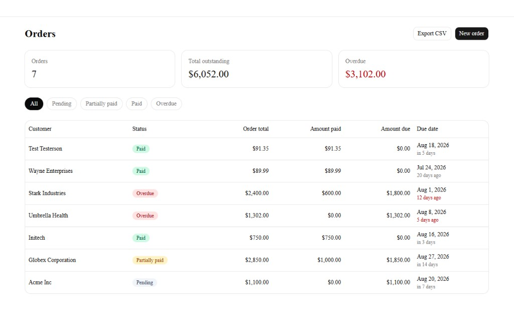
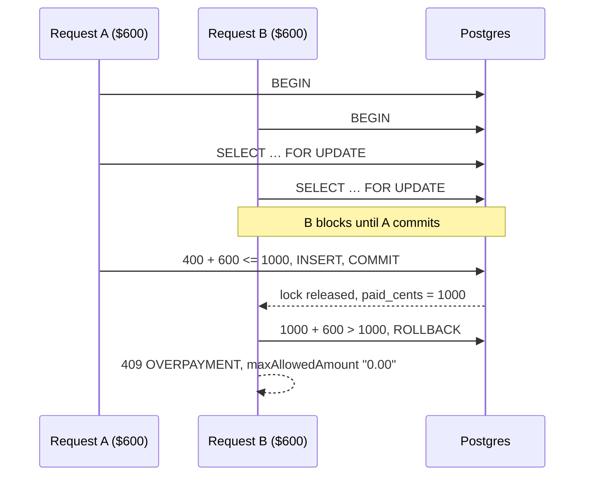

# Orders and Settlements

B2B order tracking with line items, partial payments, derived status, and a hard guarantee that recorded payments cannot exceed an order total — including when two requests arrive at the same instant.

**Live app:** [https://orders-and-settlements-tau.vercel.app](https://orders-and-settlements-tau.vercel.app)

**Demo login:** `demo@example.com` / `demo-password-123`



Next.js 16 · Postgres (Neon) · Prisma 7 · Better Auth · Tailwind / shadcn

---

## Quick start

Prerequisites: Node 20+ and a [Neon](https://neon.tech) project (free tier is enough).

```bash
git clone https://github.com/SuiCarrot/orders-and-settlements.git
cd orders-and-settlements
npm install
cp .env.example .env      # fill in the values below
npx prisma migrate deploy
npm run db:seed
npm run dev
```

`.env` needs two connection strings because Neon exposes two ways in: `DATABASE_URL` is the **pooled** hostname (contains `-pooler`) used by the app at runtime; `DIRECT_URL` is the **direct** hostname used by Prisma CLI for migrations. Also set `BETTER_AUTH_SECRET` (`openssl rand -base64 32`) and `BETTER_AUTH_URL=http://localhost:3000`.

```bash
npm test                  # unit tests — no database
npm run test:integration  # concurrency test — needs TEST_DATABASE_URL
npm run verify:scenario   # assignment scenario against a running server
```

Integration tests share the Neon project under a dedicated `test_isolation` schema so truncating tables cannot touch demo data. Create it once with `npx tsx scripts/setup-test-schema.ts`, then `npx prisma migrate deploy --config prisma.test.config.ts`.

---

## API overview

| Method | Path | Purpose |
|--------|------|---------|
| `POST` | `/api/auth/sign-up/email` | Register |
| `POST` | `/api/auth/sign-in/email` | Sign in |
| `POST` | `/api/auth/sign-out` | Sign out |
| `GET` | `/api/orders` | List (filter by `status`, paginate with `page` / `perPage`) |
| `GET` | `/api/orders/export` | CSV download (`from`, `to`, optional `status`; max 366 days) |
| `POST` | `/api/orders` | Create with line items |
| `GET` | `/api/orders/:id` | Detail with items, payments, refunds and activity |
| `PATCH` | `/api/orders/:id` | Update (password required; line items lock after first payment) |
| `DELETE` | `/api/orders/:id` | Delete (password required; rejected once any payment exists) |
| `POST` | `/api/orders/:id/payments` | Record a payment |
| `POST` | `/api/orders/:id/payments/:paymentId/refunds` | Record a refund against a payment |

Conventions:

- Money crosses the wire as a **decimal string** (`"1000.00"`), never a JSON number.
- Dates are `YYYY-MM-DD`.
- Every non-2xx body is `{ "error": { "code", "message", "details?" } }`.
- `400` validation, `401` unauthenticated, `404` not found **or not yours**, `409` business-rule conflict.

### Create an order

```bash
curl -s -X POST "$BASE/api/orders" \
  -H "Content-Type: application/json" \
  -H "Cookie: $SESSION" \
  -d '{
    "customer": "Acme Inc",
    "dueDate": "2026-09-01",
    "items": [{ "description": "Widget", "quantity": 2, "unitPrice": "500.00" }]
  }'
```

```json
{
  "data": {
    "id": "…",
    "customer": "Acme Inc",
    "dueDate": "2026-09-01",
    "status": "pending",
    "orderTotal": "1000.00",
    "amountPaid": "0.00",
    "amountDue": "1000.00",
    "items": [
      { "description": "Widget", "quantity": 2, "unitPrice": "500.00", "lineTotal": "1000.00" }
    ],
    "payments": []
  }
}
```

### Record a payment, then reject an overpayment

```bash
curl -s -X POST "$BASE/api/orders/$ID/payments" \
  -H "Content-Type: application/json" \
  -H "Cookie: $SESSION" \
  -d '{ "amount": "400.00", "date": "2026-08-13" }'
# → status: partially_paid, amountDue: "600.00"

curl -s -X POST "$BASE/api/orders/$ID/payments" \
  -H "Content-Type: application/json" \
  -H "Cookie: $SESSION" \
  -d '{ "amount": "700.00", "date": "2026-08-13" }'
```

```json
{
  "error": {
    "code": "OVERPAYMENT",
    "message": "Payment of $700.00 exceeds the remaining balance of $600.00 for this order.",
    "details": {
      "maxAllowedAmount": "600.00",
      "orderTotal": "1000.00",
      "amountPaid": "400.00",
      "attemptedAmount": "700.00"
    }
  }
}
```

The UI turns `maxAllowedAmount` into a "Use $600.00 instead" button. That is what "actionable error" means here: the number is data, not a sentence to parse.

`GET /api/orders` without a session returns `401`, not an empty list.

---

## Status derivation

Status is not a column. It is a pure function of `totalCents`, `paidCents`, `dueDate` and today (`src/server/domain/status.ts`). The four labels in the assignment are not mutually exclusive — an order can be both partially paid and past due — so the branch order *is* the business rule:

1. **`paid` wins over everything.** An order that was overdue and has since been settled shows as `paid`. Status answers "what do I need to do about this order"; a settled order needs nothing. The history of having been late is real information, but it belongs in an audit log, not in a field that drives a work queue.
2. **`overdue` wins over `partially_paid` and `pending`.** A half-paid order that is past due is more urgent than one that is not. Collapsing the two would hide it from the overdue filter.
3. **Otherwise `partially_paid` if anything has been paid, else `pending`.**

Due dates are compared as **calendar days in UTC**. An order due today is not overdue; it becomes overdue at `00:00:00Z` the following day.

A zero-total order would be born `paid`. Prevented upstream: at least one line item, total of at least one cent, plus a CHECK constraint.

The seed includes two rows that exist only to make the precedence clickable: Stark Industries (partially paid and past due → `overdue`) and Wayne Enterprises (settled after the due date → `paid`).

---

## Concurrent payments

The naive read-then-write loses. On an order with $600 remaining, two simultaneous $600 payments both read `paidCents = 400`, both conclude there is room, and both insert. Wrapping the same code in a transaction does **not** fix it: Postgres defaults to `READ COMMITTED`, under which both transactions still see the pre-write value. The read has to take a lock.



`SELECT … FOR UPDATE` is the only raw SQL in the app, and only for the lock — Prisma has no `FOR UPDATE` in its fluent API. Values are bound as parameters. A `CHECK (paid_cents <= total_cents)` constraint is the last line of defence if every layer above somehow fails.

Alternatives considered:

- **`SERIALIZABLE` with retry** — equally correct. Rejected because it needs retry plumbing at every call site, and the failure mode under contention is aborts rather than short waits.
- **A single conditional `UPDATE … WHERE paid_cents + $1 <= total_cents`** — atomic and fast. Rejected because zero affected rows is ambiguous (missing, not yours, or overpaid), so producing the actionable error would need a second query anyway.
- **Optimistic locking with a version column** — extra column and a retry path to solve a problem a row lock already solves in one statement.

Proven by `tests/integration/payments.test.ts` against a real Postgres schema. Unit tests cannot demonstrate this, because the guarantee comes from the database.

---

## Editability after payment

Once an order has at least one payment, **line items become read-only**. `customer` and `dueDate` stay editable. `DELETE` is rejected.

Editing and deleting both require the signed-in user's **password in the request body**, checked against the stored credential hash. A valid session cookie is not enough — the UI asks for the password again before the change is sent.

Editing line items changes `totalCents`, and `totalCents` is the ceiling every recorded payment was validated against. Lowering it below `paidCents` would either violate the CHECK constraint or retroactively turn a valid payment into an overpayment. Once money has moved against a document, the amounts on that document are history.

A misspelled customer name or a renegotiated due date do not have that property. A system that forces a user to void a paid order to fix a typo will simply be worked around.

---

## Stretch goals

Shipped after the scored core:

- **Audit log.** `order_events` written inside the same transaction as the change they describe. Status in the log is derived with the same function the UI uses. Seeded demo orders created before this shipped have no historical events; new activity is logged.
- **CSV export.** Dashboard control and `GET /api/orders/export?from=&to=&status=`. Same filters as the list endpoint. Fields are RFC 4180-quoted; values starting with `=`, `+`, `-` or `@` are prefixed to prevent spreadsheet formula injection. Range is capped at 366 days.
- **Refunds.** A separate `Refund` row referencing the payment it reverses — never a negative payment. The same `SELECT … FOR UPDATE` serialises a refund racing a payment. `paidCents` is decremented, so derived status flows backwards (`paid` → `partially_paid` / `overdue` / `pending`) without a new status.

---

## Assumptions and trade-offs

- **Single implicit currency.** Every amount is in the same one. No currency code is stored.
- **Integer cents in the database, decimal strings on the wire.** IEEE-754 never enters the ledger. `"0.10" + "0.20"` is exactly `"0.30"`.
- **Status derived on read**, so it cannot drift from the payments that produce it.
- **`paidCents` denormalised onto the order** so it can be locked and indexed. The CHECK constraint plus a planned reconciliation job are the safety net; a full double-entry ledger is the longer-term model.
- **Authentication delegated to Better Auth** (scrypt, revocable sessions). Hand-rolled bcrypt+JWT was considered and rejected: the version worth defending in a fintech review is days of work in an area the assignment excluded from scoring.
- **`proxy.ts` is not a security boundary.** It only checks that a cookie *exists*, so a logged-out visitor is redirected without a flash of empty UI. Authorization is `requireUser()` plus `userId` on every query. Next.js middleware can be bypassed (CVE-2025-29927); treating it as auth would be the mistake a reviewer looks for.
- **Offset pagination** on the API; the dashboard filters the loaded list in the browser so status tabs do not round-trip to Neon. Opening an order from that list reads the already-fetched payload from a tab-local cache (`sessionStorage`) instead of querying the order again.
- **Payments are append-only.** A mistake is a `Refund` row that decrements `paidCents`, not an `UPDATE` or `DELETE` on the payment. Derived status flows backwards for free.

---

## Testing

The three areas the assignment names:

| Area | Where |
|------|--------|
| Line-item math / money | `tests/unit/money.test.ts`, `tests/unit/totals.test.ts` |
| Status transitions | `tests/unit/status.test.ts` (full matrix, including paid-after-due and refund reversals) |
| Overpayment rejection | `tests/unit/payment-rules.test.ts` |
| Refund ceiling | `tests/unit/refund-rules.test.ts` |
| Concurrent overpayment / refund | `tests/integration/payments.test.ts`, `tests/integration/refunds.test.ts` |
| CSV quoting / injection | `tests/unit/csv.test.ts` |

The assignment scenario (2 × $500 → $400 → $600 → reject $1) is also an HTTP script: `npm run verify:scenario`. Point it at production with `BASE_URL=https://orders-and-settlements-tau.vercel.app`.

What is deliberately not covered: React component tests, Playwright, and load tests. The domain is where the grade is; the UI is a thin client of that domain.

---

## Improvements before production

The three that would ship first:

1. **`Idempotency-Key` on payment recording** — the row lock prevents overpayment, not double-recording of a legitimate remainder after a client timeout.
2. **Rate limiting and lockout on login** — the sign-in endpoint is otherwise an unbounded password oracle.
3. **A reconciliation job** that asserts `SUM(payments) = orders.paid_cents` and alerts on drift, until a real ledger replaces the denormalised total.

The full list — what is missing, why it matters, how it would be built, and what was a scope decision versus a known gap — is in [docs/production-roadmap.md](docs/production-roadmap.md).

---

## Project structure

```
src/
  app/            # Next.js App Router — pages and route handlers
  server/
    domain/       # Pure functions. No Prisma, no Next, no HTTP.
    services/     # Transactions. Calls domain, talks to Prisma.
    http/         # Error contract and serialisation.
    auth/         # Better Auth instance and requireUser().
    db/           # Prisma client + Neon adapter.
  lib/            # Shared Zod schemas and display formatting.
tests/
  unit/           # Domain, milliseconds, no database.
  integration/    # Row lock, real Postgres.
```

The architectural rule: `src/server/domain/` imports nothing from outside that folder. That is what makes the business rules testable in isolation and what keeps the API handlers to authenticate → validate → delegate.

The phase-by-phase build notes (including why Prisma 7, Better Auth, and Next.js 16's `proxy.ts` look the way they do) live in [docs/implementation/](docs/implementation/README.md).
