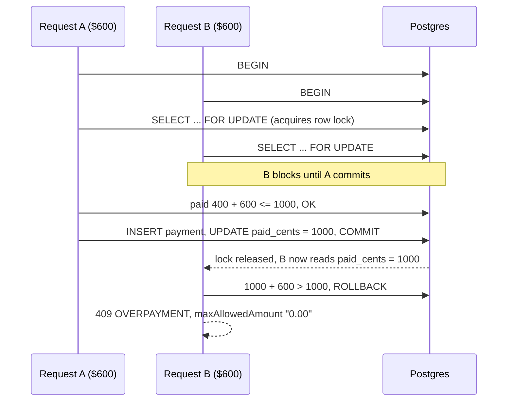

# Phase 6 — Payments API

**Goal.** Record payments against an order such that the sum of payments can never exceed the order
total, including when two requests arrive at the same instant.

**Definition of done.** The core payment scenario passes end to end, and an integration test that
fires two payments concurrently against the same order proves exactly one is accepted.

This is the phase the whole exercise is really about. Everything else is scaffolding around it.

---

## The problem

The naive implementation is a read followed by a write:

```ts
const order = await prisma.order.findFirst({ where: { id, userId } });
if (amountCents > order.totalCents - order.paidCents) throw new OverpaymentError(/* ... */);
await prisma.payment.create({ data: { orderId: id, amountCents } });
```

On an order with $600 remaining, two simultaneous $600 payments both read `paidCents = 400`, both
conclude there is room, and both insert. The order ends up $600 overpaid. Nothing about this is
exotic: a double-clicked submit button on a slow connection produces it.

Wrapping the same code in a transaction does **not** fix it. Postgres defaults to `READ COMMITTED`,
under which both transactions still see the pre-write value. The read has to actually take a lock.

## The solution



`SELECT ... FOR UPDATE` takes an exclusive lock on the order row for the duration of the
transaction. The second request does not read a stale value — it waits, then reads the value the
first request committed.

## Step 1 — The service

`src/server/services/payment-service.ts`:

```ts
import { dbTable, prisma } from "@/server/db/prisma";
import { assertPaymentFits } from "@/server/domain/payment-rules";
import { parseMoneyToCents } from "@/server/domain/money";
import { NotFoundError } from "@/server/http/errors";

interface LockedOrder {
  id: string;
  total_cents: number;
  paid_cents: number;
}

export async function recordPayment(
  userId: string,
  orderId: string,
  input: { amount: string; date: string; note?: string },
) {
  const amountCents = parseMoneyToCents(input.amount);

  return prisma.$transaction(
    async (tx) => {
      // Lock the order row. Scoping by userId here means an order belonging to
      // someone else is indistinguishable from one that does not exist.
      const [order] = await tx.$queryRaw<LockedOrder[]>`
        SELECT id, total_cents, paid_cents
        FROM ${dbTable("orders")}
        WHERE id = ${orderId} AND user_id = ${userId}
        FOR UPDATE
      `;

      if (!order) throw new NotFoundError("Order");

      // Throws OverpaymentError with the maximum allowed amount attached.
      assertPaymentFits({
        amountCents,
        totalCents: order.total_cents,
        paidCents: order.paid_cents,
      });

      const payment = await tx.payment.create({
        data: {
          orderId,
          amountCents,
          paidAt: new Date(`${input.date}T00:00:00Z`),
          note: input.note ?? null,
        },
      });

      const updated = await tx.order.update({
        where: { id: orderId },
        data: { paidCents: { increment: amountCents } },
        include: { items: true, payments: { orderBy: { paidAt: "desc" } } },
      });

      return { payment, order: updated };
    },
    { isolationLevel: "ReadCommitted", timeout: 10_000 },
  );
}
```

Details that matter here:

- **`$queryRaw` is used only for the lock**, because Prisma has no `FOR UPDATE` in its fluent API.
  Every value is interpolated as a parameter through the tagged template, not string-concatenated,
  so there is no injection surface.
- **Raw queries must go through `dbTable()`, not a bare table name.** The Neon adapter's `schema`
  option (see [02-database.md](02-database.md)) only affects SQL the fluent client generates
  itself. Hand-written raw SQL is not rewritten and resolves an unqualified `FROM orders` against
  the connection's default `search_path` — `public` — regardless of `DATABASE_SCHEMA`. This was
  caught by the integration tests below: with a bare table name, the lock query silently looked in
  `public` while the fluent `tx.order.update` in the same transaction correctly targeted
  `test_isolation`, so every payment failed with a spurious `NotFoundError`. `src/server/db/prisma.ts`
  exports `dbTable(name)`, which every raw query in the codebase uses instead.
- **Raw SQL means snake_case.** The query bypasses Prisma's field mapping, so it returns
  `total_cents`, not `totalCents`. Typing the result as `LockedOrder` keeps that boundary explicit.
- **`increment` rather than a computed value.** Even though the row is already locked, an atomic
  increment keeps the write correct on its own terms.
- **`ReadCommitted` is sufficient** because the lock provides the serialisation, and it avoids the
  retry loop that `Serializable` would require.
- **The transaction stays short.** No email sending, no external calls. A lock held across a
  network round-trip to a third party is how a payment endpoint takes down a database.
- **The CHECK constraint from [02-database.md](02-database.md) is the last line of defence.** If
  every layer above somehow fails, `paid_cents <= total_cents` makes the write fail rather than
  silently corrupt the ledger.

### Alternatives considered

Recorded in the README, because the concurrency approach deserves the same rigour as the rest of
the design record.

**`SERIALIZABLE` isolation with retry.** Postgres would abort one of the two transactions with a
serialisation failure, and the application would retry it, at which point it would correctly see
the new balance and reject. Equally correct. Rejected because it needs retry plumbing around every
call site, and the failure mode under contention is worse: aborts rather than short waits.

**A single conditional UPDATE.**

```sql
UPDATE orders SET paid_cents = paid_cents + $1
WHERE id = $2 AND user_id = $3 AND paid_cents + $1 <= total_cents
```

Atomic with no explicit lock, and the fastest option. Rejected because zero affected rows is
ambiguous — order missing, not yours, or overpaid — so producing an actionable error would
require a second query anyway, and the payment row still has to be inserted in the same
transaction. The explicit lock says what it means.

**Optimistic locking with a version column.** Adds a column and a retry path to solve a problem
that a row lock already solves in one statement. Reasonable at high write volume on the same row,
which is not this workload.

## Step 2 — Route handler

`src/app/api/orders/[id]/payments/route.ts`:

```ts
export const POST = handler(async (request: NextRequest, { params }: RouteContext) => {
  const user = await requireUser();
  const { id } = await params;
  const input = createPaymentSchema.parse(await request.json());

  const { order } = await recordPayment(user.id, id, input);

  return NextResponse.json({ data: serialiseOrder(order) }, { status: 201 });
});
```

The response returns the whole updated order rather than just the payment, so the client gets the
new status and amount due without a follow-up request.

Schema:

```ts
export const createPaymentSchema = z.object({
  amount: z
    .string()
    .regex(/^\d{1,13}(\.\d{1,2})?$/, 'Use a decimal amount, e.g. "400.00".')
    .refine((v) => parseMoneyToCents(v) >= 1, "Payment must be at least $0.01."),
  date: z.iso.date(),
  note: z.string().trim().max(500).optional(),
});
```

## Step 3 — Integration tests

Unit tests cannot prove any of this, because the guarantee comes from Postgres. These tests run
against the Neon `test` branch created in [02-database.md](02-database.md).

`vitest.integration.config.ts` sets `DATABASE_URL` to `TEST_DATABASE_URL` and `DATABASE_SCHEMA` to
`test_isolation` via Vitest's `test.env`, applied before any test file (or the Prisma singleton it
imports) loads — a `setupFiles` side effect would run too late, since ESM `import` statements are
hoisted above it. `tests/integration/setup.ts` then truncates the tables between tests and ensures
a stable test user exists (orders have a foreign key to `users`):

```ts
beforeEach(async () => {
  await prisma.$executeRaw`TRUNCATE ${dbTable("payments")}, ${dbTable("order_items")}, ${dbTable("orders")} RESTART IDENTITY CASCADE`;
  await prisma.user.upsert({ where: { id: TEST_USER_ID }, update: {}, create: { /* ... */ } });
});
```

**The core scenario**, verified exactly as written:

```ts
it("follows the core payment scenario end to end", async () => {
  const order = await createOrder(userId, {
    customer: "Acme Inc",
    dueDate: addDays(new Date(), 7).toISOString().slice(0, 10),
    items: [{ description: "Widget", quantity: 2, unitPrice: "500.00" }],
  });
  expect(order.totalCents).toBe(100_000);

  const first = await recordPayment(userId, order.id, { amount: "400.00", date: today });
  expect(serialiseOrder(first.order).status).toBe("partially_paid");
  expect(serialiseOrder(first.order).amountDue).toBe("600.00");

  const second = await recordPayment(userId, order.id, { amount: "600.00", date: today });
  expect(serialiseOrder(second.order).status).toBe("paid");
  expect(serialiseOrder(second.order).amountDue).toBe("0.00");

  await expect(
    recordPayment(userId, order.id, { amount: "1.00", date: today }),
  ).rejects.toBeInstanceOf(OverpaymentError);
});
```

**The concurrency test**, which is the one that justifies the design:

```ts
it("accepts only one of two concurrent payments that would overpay", async () => {
  const order = await createOrder(userId, {
    customer: "Acme Inc",
    dueDate: futureDate,
    items: [{ description: "Widget", quantity: 2, unitPrice: "500.00" }],
  });

  const results = await Promise.allSettled([
    recordPayment(userId, order.id, { amount: "600.00", date: today }),
    recordPayment(userId, order.id, { amount: "600.00", date: today }),
  ]);

  const fulfilled = results.filter((r) => r.status === "fulfilled");
  const rejected = results.filter((r) => r.status === "rejected");

  expect(fulfilled).toHaveLength(1);
  expect(rejected).toHaveLength(1);
  expect((rejected[0] as PromiseRejectedResult).reason).toBeInstanceOf(OverpaymentError);

  const final = await prisma.order.findUniqueOrThrow({ where: { id: order.id } });
  expect(final.paidCents).toBe(60_000);
  expect(await prisma.payment.count({ where: { orderId: order.id } })).toBe(1);
});
```

Asserting on `paidCents` and the payment count, not just on the rejection, is what makes this a
real test — it proves no orphaned payment row was written.

Also worth covering: a payment of exactly the remaining balance succeeds, a payment against
another user's order raises `NotFoundError`, and the derived status transitions correctly at each
step.

## Step 4 — What is deliberately not handled

Both belong in [11-production-roadmap.md](11-production-roadmap.md) and are named in the README so
they read as decisions rather than oversights.

**Idempotency.** A client that retries after a timeout can record the same payment twice, and both
are legitimately within the total. The fix is an `Idempotency-Key` header stored with a unique
constraint, returning the original response on replay. It is out of scope here but is table stakes
for a real payment endpoint.

**Payment reversal.** There is no way to delete or amend a payment. In a real ledger the answer is
never a `DELETE` — it is a compensating entry, which is the refund design sketched in
[13-extras.md](13-extras.md).

## Step 5 — Commit

```bash
git commit -am "feat: record payments with row-level locking and overpayment rejection"
```
